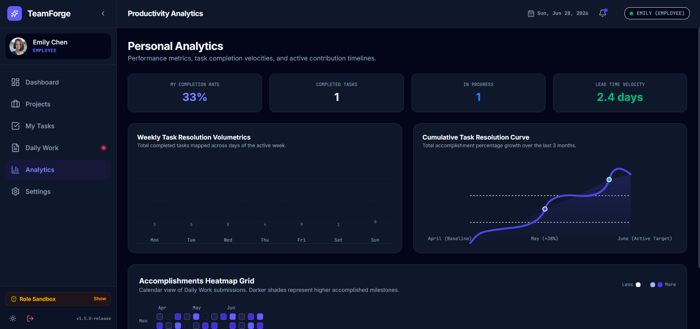

# TeamForge Project Setup Guide

This guide outlines the steps to set up and run the TeamForge React-Vite-Tailwind application on your local machine.

## Preview



---

## Step 1: Install the Prerequisites

To run this application locally, you need Node.js installed on your computer.

1. **Download Node.js**: Go to the official [Node.js Website](https://nodejs.org/) and download the LTS (Long Term Support) version (v18 or newer is recommended).
2. **Install**: Run the installer, accept the default settings, and ensure the option to "Add to PATH" is checked.
3. **Verify Installation**: Open your terminal (Command Prompt, PowerShell, or terminal of choice) and run the following commands:

```bash
node -v
npm -v
```

If both commands return version numbers, the installation was successful.

---

## Step 2: Download the Application Code

You need to save the source files to your local drive.

1. In the Google AI Studio interface, navigate to the top-right settings/export menu and click **Export as ZIP** (or export to GitHub if you prefer to clone the repository).
2. Extract the downloaded ZIP file into a dedicated folder on your machine (for example, `C:\Projects\TeamForge`).

---

## Step 3: Open the Project in a Terminal

1. Open your terminal of choice (such as VS Code integrated terminal, PowerShell, or Command Prompt).
2. Navigate to your project folder using the change directory command:

```powershell
cd C:\Projects\TeamForge
```

---

## Step 4: Install Project Dependencies

Run the package manager command to download and install the required React, Tailwind CSS, Motion, and Lucide icon libraries:

```bash
npm install
```

This command will create a `node_modules` directory in your project root containing the necessary dependency packages.

---

## Step 5: Configure Environment Variables (Optional)

The application includes an `.env.example` file. If you plan to use features that require API keys:

1. Duplicate the `.env.example` file in your root folder and rename the copy to `.env`.
2. Open the `.env` file in a text editor (such as VS Code or Notepad).
3. Set your configuration keys as needed:

```env
GEMINI_API_KEY="your_actual_gemini_api_key_here"
APP_URL="http://localhost:3000"
```

---

## Step 6: Start the Local Development Server

Start the local server using the following command:

```bash
npm run dev
```

This starts the Vite development server. By default, it will host on:

- **URL**: `http://localhost:3000`

Open this URL in a web browser (such as Chrome, Edge, or Firefox) to view, test, and interact with the TeamForge Dashboard.
